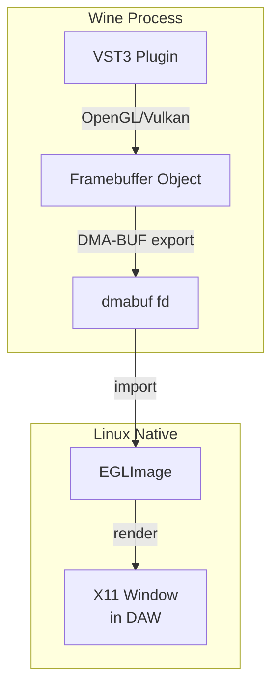
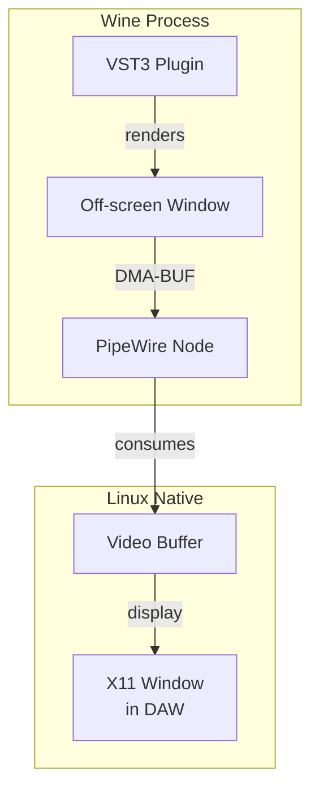
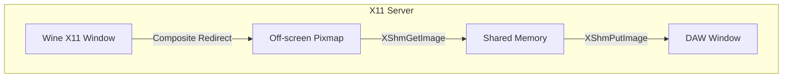
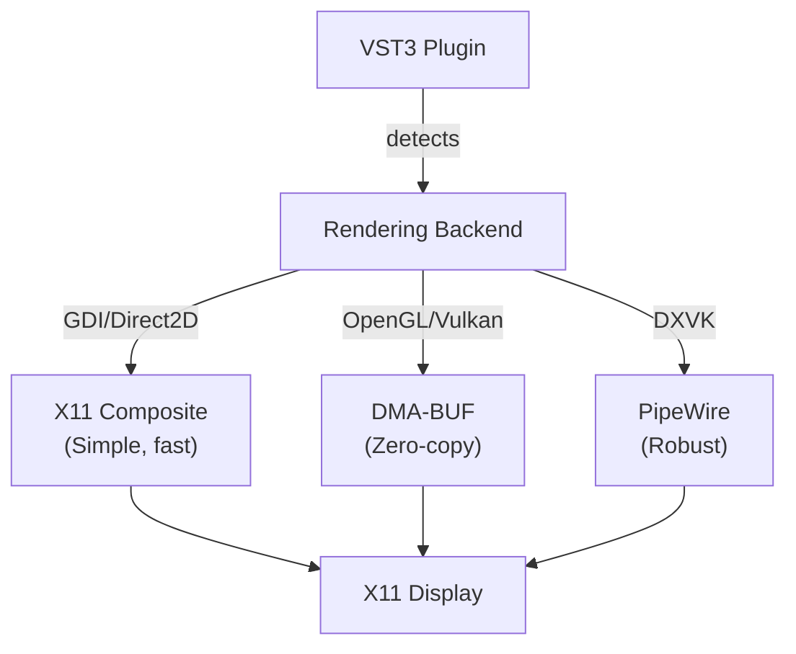

# VST3 Bridge Architecture Alternatives

## Overview

Given your requirements:
- ✅ GPU-accelerated plugins (OpenGL/Vulkan/DXVK)
- ✅ Plugin groups (multiple plugins per Wine process)
- ✅ Target: REAPER and Ardour
- ✅ Wine 11 (latest staging)
- ✅ Real-time GUI (minimal latency)

Here are the three viable approaches:

---

## Option 1: DMA-BUF/GBM Texture Sharing (Recommended for GPU)

**Concept**: Plugin renders to GPU texture in Wine → Share texture via DMA-BUF → Display in Linux DAW

**Complexity**: HIGH
- Need to intercept OpenGL/Vulkan contexts in Wine
- Handle DMA-BUF import/export
- Manage GPU memory synchronization
- Different code paths for each graphics API

**Pros**:
- ✅ Real-time (sub-millisecond latency)
- ✅ Zero-copy GPU-to-GPU transfer
- ✅ Works with all GPU APIs
- ✅ Most future-proof

**Cons**:
- ❌ Very complex implementation
- ❌ Requires deep Wine integration
- ❌ Debugging GPU issues is difficult
- ❌ May not work with proprietary NVIDIA drivers easily

---

## Option 2: PipeWire Video Capture (Balanced)

**Concept**: Create Wine window off-screen → PipeWire captures it → Stream to Linux side

**Complexity**: MEDIUM-HIGH
- Set up PipeWire stream from Wine window
- Configure video format negotiation
- Handle buffer synchronization

**Pros**:
- ✅ Works with all GPU APIs (handled by PipeWire)
- ✅ Standard Linux infrastructure
- ✅ Good performance (DMA-BUF under the hood)
- ✅ Handles compositor/ Wayland compatibility

**Cons**:
- ⚠️ 1-2 frames latency (16-33ms at 60fps)
- ⚠️ Requires PipeWire (standard on modern distros)
- ⚠️ More moving parts

---

## Option 3: X11 Composite Redirection (Simpler, Limited)

**Concept**: Use X11 Composite extension to redirect Wine window → Capture pixmap → Display

**Complexity**: MEDIUM
- Enable Composite redirect on Wine window
- Read pixmap via shared memory
- Display in DAW's X11 window

**Pros**:
- ✅ Simpler implementation
- ✅ No GPU-specific code
- ✅ Works on any X11 setup

**Cons**:
- ❌ **Does NOT work with GPU-accelerated rendering** (OpenGL/Vulkan bypass X11 pixmaps)
- ⚠️ CPU memory copy required
- ⚠️ Higher CPU usage
- ❌ Limited to GDI/Direct2D plugins only

---

## Option 4: Hybrid Approach (My Recommendation)

**Concept**: Detect rendering method → Use appropriate path

**Implementation Strategy**:
1. **Phase 1**: Start with X11 Composite for GDI plugins (fastest to implement)
2. **Phase 2**: Add PipeWire capture for GPU plugins (broad compatibility)
3. **Phase 3**: Optimize with DMA-BUF for latency-critical scenarios

---

## Comparison Matrix

| Approach | Latency | GPU Support | Complexity | Maintenance |
|----------|---------|-------------|------------|-------------|
| DMA-BUF/GBM | <1ms | ✅ Full | Very High | Hard |
| PipeWire | ~16-33ms | ✅ Full | Medium-High | Medium |
| X11 Composite | ~16-33ms | ❌ GDI only | Medium | Easy |
| **Hybrid** | Variable | ✅ Full | Medium | Medium |

---

## My Recommendation

Given your requirements, I recommend starting with the **Hybrid Approach** focusing on:

### Phase 1 (MVP): X11 Composite + Wine 11
- Use off-screen window with Composite redirect
- Works for GDI/Direct2D plugins immediately
- Gets you a working solution fastest

### Phase 2: PipeWire for GPU Plugins  
- Add PipeWire capture for OpenGL/Vulkan/DXVK
- Broad compatibility, reasonable latency
- Handles the GPU plugins you need

### Phase 3: DMA-BUF Optimization (Optional)
- Only if Phase 2 latency isn't acceptable
- Optimize the most common paths

This gives you:
- ✅ Working solution quickly (Phase 1)
- ✅ GPU plugin support (Phase 2)
- ✅ Room for optimization (Phase 3)
- ✅ Manageable complexity
