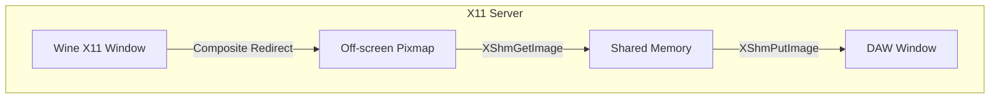

# VST3 Bridge Architecture Alternatives

## Overview

## X11 Composite Redirection (Simpler, Limited)

**Concept**: Use X11 Composite extension to redirect Wine window → Capture pixmap → Display

**Complexity**: MEDIUM
- Enable Composite redirect on Wine window
- Read pixmap via shared memory
- Display in DAW's X11 window

**Pros**:
- ✅ Simpler implementation
- ✅ No GPU-specific code
- ✅ Works on any X11 setup

**Cons**:
- ❌ **Does NOT work with GPU-accelerated rendering** (OpenGL/Vulkan bypass X11 pixmaps)
- ⚠️ CPU memory copy required
- ⚠️ Higher CPU usage
- ❌ Limited to GDI/Direct2D plugins only

---
