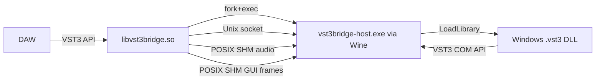

# VST3 Bridge – Proper Implementation Plan v2

## Executive Summary

After detailed code review, the project has a good high-level skeleton but contains multiple critical issues that prevent it from functioning. This plan provides a step-by-step approach to building a working VST3 bridge without shortcuts.

---

## Critical Bugs Found in Current Code

### 1. Duplicate Struct Declarations in `protocol.h`
[`MsgRequestCanProcessSampleSize`](src/common/protocol.h:307) is declared **twice** (lines 307 and 342). This is a direct compilation error that stops the Wine host from building.

### 2. Custom SDK Headers vs Real VST3 SDK
The custom VST3 stub headers in [`src/vst3-sdk/`](src/vst3-sdk/) deviate from the real Steinberg SDK in several ways:
- [`parameter_changes.h`](src/wine-host/parameter_changes.h) uses `Steinberg::Vst::IParamValueQueue` and `Steinberg::Vst::IParameterChanges` — namespaced under `Vst` — but the custom [`iparameterchanges.h`](src/vst3-sdk/iparameterchanges.h) defines them directly in the `Steinberg` namespace. This mismatch causes 40+ compilation errors in the Wine host.
- [`DECLARE_FUNKNOWN_METHODS`](src/wine-host/plugin_instance.cpp:31), [`IMPLEMENT_REFCOUNT`](src/wine-host/plugin_instance.cpp:55), [`IMPLEMENT_QUERYINTERFACE`](src/wine-host/plugin_instance.cpp:56), and `TUID` are used in [`plugin_instance.cpp`](src/wine-host/plugin_instance.cpp) but not defined in the custom SDK headers.
- `String128`, `IHostApplication`, `TUID` types are missing entirely.

### 3. `vst3_host.h` holds `factory_` as `void*`
[`VST3Host::getFactory()`](src/wine-host/vst3_host.h:66) returns `void*`. The Wine host message handler then calls `factory->countClasses()` on a `void*` — this will not compile, and even if it did it would be undefined behaviour.

### 4. `plugin_instance.cpp` casts `component_` (`void*`) to interface pointers unsafely
[`PluginInstance::initialize()`](src/wine-host/plugin_instance.cpp:76) does `static_cast<IPluginBase*>(component_)` where `component_` is `void*`. This requires the real COM QueryInterface pattern.

### 5. `host_main.cpp` message type mismatches
[`host_main.cpp`](src/wine-host/host_main.cpp) handles `MsgType::GuiCreate`, `MsgType::GuiCreated`, `MsgType::GuiDestroy`, `MsgType::StateSave`, `MsgType::StateData`, etc., which do not exist in [`protocol.h`](src/common/protocol.h). The protocol defines `MsgType::CreateView`, `MsgType::SetState`, `MsgType::GetState`, etc.

### 6. Audio processing message flow mismatch
[`plugin_proxy.cpp`](src/native/plugin_proxy.cpp) sends `MsgType::Process`, waits for `MsgType::AudioReady`, sends `MsgType::AudioProcess`, waits for `MsgType::ProcessComplete`. But [`audio_processor.cpp`](src/wine-host/audio_processor.cpp) sends `MsgType::AudioReady` at startup (not per-block), waits for `MsgType::AudioProcess`, sends `MsgType::ProcessComplete`. The handshake ordering is wrong.

### 7. `SpeakerArr::getChannelCount()` does not exist
[`audio_processor.cpp`](src/wine-host/audio_processor.cpp:100) calls `SpeakerArr::getChannelCount(arrangement)` but this function is not defined in the custom [`iaudioprocessor.h`](src/vst3-sdk/iaudioprocessor.h). The `SpeakerArr` namespace only defines constants.

### 8. `AudioBusBuffers` structure mismatch
[`audio_processor.cpp`](src/wine-host/audio_processor.cpp) accesses `bus.channelBuffers32` and `bus.silenceFlags`, but the custom [`iaudioprocessor.h`](src/vst3-sdk/iaudioprocessor.h:63) defines `AudioBusBuffers` with `channelBuffers64` and a custom helper — no `channelBuffers32` or `silenceFlags` field.

### 9. Socket message framing is incomplete
[`WineSocketClient::sendMessage()`](src/wine-host/host_main.cpp:135) does not fill `header.magic` or `header.version`, making the header invalid. The native [`socket.cpp`](src/common/socket.cpp) presumably validates these.

### 10. Wine Host has no real plugin DLL loading
[`vst3_host.cpp`](src/wine-host/vst3_host.cpp) initializes and shuts down but `loadPlugin()` is not implemented at all (the function does not even exist in the `.cpp`, only declared in `.h`).

---

## Architecture Overview



The native library acts as a VST3 plugin to the DAW, but internally it is a proxy: all calls are serialised over a Unix socket to the Wine host process, which executes them against the real Windows plugin DLL.

---

## Phase 0: Fix Compilation Errors (Critical, do first)

### 0.1 Remove duplicate struct in `protocol.h`
- Delete the second `MsgRequestCanProcessSampleSize` and `MsgResponseCanProcessSampleSize` declarations (lines 341–348). Keep only the first (lines 307–313).

### 0.2 Adopt the real Steinberg VST3 SDK
**Recommendation**: Instead of maintaining custom stub headers, vendor the official Steinberg open-source VST3 SDK (https://github.com/steinbergmedia/vst3sdk) as a git submodule under `third_party/vst3sdk/`. The custom SDK stubs are incomplete and will diverge further as implementation proceeds.

If vendoring the real SDK is not desired, the custom headers must be fixed to provide:
- `TUID` type alias (`typedef char TUID[16]`)
- `String128` type alias (`typedef char16_t String128[128]`)
- `DECLARE_FUNKNOWN_METHODS`, `IMPLEMENT_REFCOUNT`, `IMPLEMENT_QUERYINTERFACE` macros
- `IHostApplication` interface
- `Steinberg::Vst` namespace with `IParamValueQueue`, `IParameterChanges`, `ParamValue`, `ParamID`
- `SpeakerArr::getChannelCount()` helper function

### 0.3 Fix `AudioBusBuffers`
Add `silenceFlags` field and `channelBuffers32` pointer to match the real SDK:
```cpp
struct AudioBusBuffers {
    int32    numChannels;
    uint64   silenceFlags;
    union {
        float**  channelBuffers32;
        double** channelBuffers64;
    };
};
```

### 0.4 Align `host_main.cpp` message types with `protocol.h`
Replace all references to non-existent `MsgType` values (`GuiCreate`, `GuiDestroy`, `StateSave`, `StateRestore`, `StateData`, `InstanceCreated`, `GuiCreated`, `MsgGuiCreated`, `MsgStateRestored`, `MsgSetSize`, `MsgSizeSet`) with the corresponding actual types from `protocol.h`.

---

## Phase 1: Wine Host — Real Plugin Loading

### 1.1 Implement `VST3Host::loadPlugin()`
File: [`src/wine-host/vst3_host.cpp`](src/wine-host/vst3_host.cpp)

```
1. LoadLibraryW(path)  → HMODULE
2. GetProcAddress("GetPluginFactory") → VST3EntryPoint
3. Call entry point → IPluginFactory*
4. Store as IPluginFactory* (not void*)
5. Track module handle for FreeLibrary on shutdown
```

Change `factory_` in [`vst3_host.h`](src/wine-host/vst3_host.h) from `void*` to `Steinberg::IPluginFactory*`.

### 1.2 Proper QueryInterface-based instance creation
File: [`src/wine-host/plugin_instance.h`](src/wine-host/plugin_instance.h) and `.cpp`

Change `component_` and `controller_` from `void*` to properly typed interface pointers:
```cpp
Steinberg::IComponent*       component_    = nullptr;
Steinberg::IAudioProcessor*  audioProc_    = nullptr;
Steinberg::IEditController*  controller_   = nullptr;
Steinberg::IPlugView*        view_         = nullptr;
```

Instance creation flow:
```
factory->createInstance(cid, IComponent_iid, &component)
component->queryInterface(IAudioProcessor_iid, &audioProc)
component->getControllerClassId(&controllerCid)
factory->createInstance(controllerCid, IEditController_iid, &controller)
  -- OR --
component->queryInterface(IEditController_iid, &controller)  // single component
```

### 1.3 `IHostApplication` implementation
File: create [`src/wine-host/host_application.h`](src/wine-host/host_application.h) and `.cpp`

A proper implementation of `IHostApplication::getName()` returning "VST3 Bridge" and `createInstance()` returning `kNotImplemented`. This is passed to `IPluginBase::initialize()`.

---

## Phase 2: Audio Processing Pipeline

### 2.1 Fix audio processing handshake flow
Current flow is broken. The correct design:

```
Native (process() called by DAW):
  → send MsgRequestProcess {num_samples, num_inputs, num_outputs}
  → (audio data is already in shared memory input region, written before message)
  → wait for MsgResponseProcess

Wine host (in message loop or audio thread):
  → receive MsgRequestProcess
  → read from shared memory input region  
  → call IAudioProcessor::process()
  → write to shared memory output region
  → send MsgResponseProcess {result}
```

The current design with `MsgType::AudioReady` / `MsgType::AudioProcess` / `MsgType::ProcessComplete` should be simplified or properly implemented:
- Option A (simpler): Synchronous request/response pattern — use shared memory for data, socket only for synchronization signals.
- Option B (the current design intent): Wine host sends `AudioReady` once at startup to report its bus config, then each process call is `AudioProcess` → `ProcessComplete`.

**Recommendation: Option A** for correctness; optimise later.

### 2.2 Fix shared memory synchronization
[`AudioSharedMemory`](src/common/shared_memory.h:103) and [`AudioSharedMemoryHost`](src/wine-host/audio_shm_host.h) need to ensure the native process writes input data *before* the Wine process reads it, and the Wine process writes output *before* the native process reads it. The current design relies on socket messages for this synchronization, which is correct — but the implementation must be consistent.

### 2.3 Fix `SpeakerArr::getChannelCount()`
Implement it by counting set bits in the `SpeakerArrangement` bitmask:
```cpp
inline int32 getChannelCount(SpeakerArrangement arr) {
    return (int32)__builtin_popcountll(arr);
}
```

### 2.4 Parameter changes forwarding
The [`PluginProxy::process()`](src/native/plugin_proxy.cpp:309) must serialize `data.inputParameterChanges` and send it as `MsgParamChanges` before the audio process message. The Wine host must deserialize and populate `ParameterChanges` before calling `IAudioProcessor::process()`.

---

## Phase 3: GUI Pipeline

### 3.1 Fix off-screen window and view attachment
The Wine host creates an off-screen HWND. The VST3 view is attached to it via `IPlugView::attached(hwnd, "HWND")`. The window must be shown (`SW_SHOWNOACTIVATE`) for GDI to render to it; the plugin renders in response to `WM_PAINT` which must be triggered.

```
Wine side:
  1. CreateWindowEx(WS_POPUP | WS_CLIPSIBLINGS, ..., OFFSCREEN_X, OFFSCREEN_Y)
  2. view->attached(hwnd, "HWND")
  3. view->getSize(&size) → get actual plugin size
  4. SetWindowPos to actual size
  5. Start GDI capture thread
  6. Send MsgResponseCreateView with width/height

Native side:
  1. create FrameSharedMemory (max 4096x4096)
  2. send MsgRequestCreateView {name, parent=x11_window_id, platform_type="X11 EmbedWindowID"}
  3. wait for response → get width/height
  4. resize X11 window to match
  5. start frame receive loop
```

### 3.2 GDI capture loop
File: [`src/wine-host/gdi_capture.cpp`](src/wine-host/gdi_capture.cpp)

The current `capture()` method allocates a `std::vector<uint8_t>` every frame — this is unacceptable for performance. Fix by:
- Using a DIB section (already partially done with `CreateDIBSection`) where `bits` pointer is obtained once and reused
- Writing directly into `FrameSharedMemory::beginWrite()` buffer

The capture loop should run in a dedicated thread at ~30fps, triggered by `WM_PAINT` invalidation notifications or a timer.

### 3.3 X11 display with XShm
File: [`src/native/x11_window.cpp`](src/native/x11_window.cpp), [`src/native/gui_handler.cpp`](src/native/gui_handler.cpp)

The native side receives `MsgFrameUpdate`, reads from `FrameSharedMemory`, and calls `XShmPutImage()` or `XPutImage()` to display in the native X11 window. Respond with `MsgFrameAck`.

### 3.4 X11 → Windows event translation
File: [`src/native/gui_handler.cpp`](src/native/gui_handler.cpp), [`src/wine-host/gui_event_receiver.cpp`](src/wine-host/gui_event_receiver.cpp)

Native side captures XCB events and sends `MsgInputEvent`. Wine host receives and calls `PostMessage(hwnd, WM_MOUSEMOVE/WM_LBUTTONDOWN/WM_KEYDOWN, ...)`.

Key mappings needed:
- XCB button press → `WM_LBUTTONDOWN`/`WM_RBUTTONDOWN`/`WM_MBUTTONDOWN`
- XCB button release → `WM_LBUTTONUP`/`WM_RBUTTONUP`/`WM_MBUTTONUP`
- XCB key press → `WM_KEYDOWN` with VK translation
- XCB scroll → `WM_MOUSEWHEEL`
- XCB configure notify → `WM_SIZE`

---

## Phase 4: State Management

### 4.1 `IBStream` implementation
Create [`src/common/istream_impl.h`](src/common/istream_impl.h) with a simple buffer-backed IBStream:
```cpp
class MemoryStream : public IBStream {
    std::vector<uint8_t> buffer_;
    int64 pos_ = 0;
    // read/write/seek/tell implementations
};
```
This is used on the Wine side to collect state from `IComponent::getState()` and feed state to `IComponent::setState()`.

### 4.2 State transfer protocol
State data can be multi-megabyte. Options:
- **Chunked transfer**: Send `MsgRequestSetState {data_size}`, then `data_size` bytes as raw socket data (not in a message header), then read on the other side.
- **Shared memory**: For large state, use a temporary shared memory segment.

The simpler approach (chunked transfer) is recommended first.

---

## Phase 5: IComponentHandler / Callback Proxy

When the user edits a parameter in the plugin GUI, the plugin calls `IComponentHandler::performEdit(id, value)`. This must flow back to the DAW:

```
Plugin → Wine IComponentHandler impl → send MsgParamChangesOutput → Native PluginProxy → stored handler → call handler->performEdit()
```

Create [`src/wine-host/component_handler.h`](src/wine-host/component_handler.h) implementing `IComponentHandler` that sends messages back over the socket.

---

## Phase 6: Threading Model

The current design mixes concerns. The proper threading model:

```
Native Process:
  - DAW audio thread: calls PluginProxy::process() (real-time safe)
  - DAW GUI thread: calls PluginProxy::createView(), setParamNormalized(), etc.
  - IPC send/receive: must be thread-safe (use mutex on socket)
  - X11 event thread: reads XCB events, sends MsgInputEvent

Wine Host Process:
  - Main/message thread: Windows message pump + IPC message loop
  - Audio processing: runs in main loop (NOT a separate thread!) to avoid
    cross-thread Windows message issues
  - GDI capture thread: captures frames at ~30fps, writes to FrameSharedMemory
```

**Important**: The audio thread on the native side must be real-time safe — no allocations, no mutexes (use lock-free queues for parameter changes), no blocking socket calls. Consider using a dedicated non-RT thread for socket I/O and passing data to the RT thread via an `std::atomic` sequence or lock-free ring buffer.

---

## Phase 7: Error Handling and Robustness

### 7.1 Wine process crash detection
Monitor the child PID with `waitpid(..., WNOHANG)` from a monitoring thread on the native side. If the child dies, mark the bridge as failed and return `kInternalError` from all calls.

### 7.2 Socket timeout handling
All socket operations must have timeouts to prevent the audio thread from hanging if Wine crashes.

### 7.3 Logging
Add a simple thread-safe logger that writes to stderr with timestamps and log levels:
```
[2026-03-09 10:00:00.123] [DEBUG] [native] PluginProxy::process(): 512 samples
[2026-03-09 10:00:00.125] [DEBUG] [wine]   AudioProcessor: processing 512 samples
```

---

## Phase 8: Build System Fixes

### 8.1 Fix meson.build for Wine cross-compilation
The current `meson.build` uses `custom_target` with explicit include paths passed as strings (`-I../src/common`). This is fragile. The correct approach is to use `meson`'s cross-file mechanism:

```
# wine.cross file (already present, needs review)
# Use: meson setup build-wine --cross-file wine.cross
```

Read the existing [`wine.cross`](wine.cross) file to understand the current setup and fix accordingly.

### 8.2 Ensure both targets build cleanly
The Linux `.so` should compile with `-Wall -Wextra -Werror`. The Wine `.exe` should compile with `wineg++` with the same warning level. Address all warnings as errors.

---

## Phase 9: Testing

### 9.1 Unit tests for protocol serialisation
Use Google Test. Test:
- `MessageHeader` encode/decode round-trip
- All request/response struct sizes (must match on both sides)
- `SharedMemory` create/open/read/write
- `FrameSharedMemory` producer/consumer ring buffer

### 9.2 Integration test with Dexed (free VST3)
[Dexed](https://github.com/asb2m10/dexed) is a free, open-source FM synthesizer available as VST3 for Windows. Use it as the integration test target.

Test sequence:
1. Load `libvst3bridge.so` configured to point at Dexed.vst3 in a test Wine prefix
2. Verify factory returns class info
3. Create instance, initialize
4. Setup processing (44100Hz, 512 samples, stereo out)
5. Send MIDI note on → verify audio output is non-zero
6. Open editor → verify frame updates arrive with non-zero pixels
7. Save state → restore state → verify plugin sounds same

---

## Files To Create (New)

| File | Purpose |
|------|---------|
| `src/wine-host/host_application.cpp/h` | IHostApplication implementation |
| `src/wine-host/component_handler.cpp/h` | IComponentHandler proxy (wine→native callback) |
| `src/common/istream_impl.h` | Memory-backed IBStream for state serialization |
| `src/common/logger.h` | Thread-safe logging |
| `tests/test_protocol.cpp` | Protocol unit tests |
| `tests/test_shared_memory.cpp` | Shared memory unit tests |
| `third_party/vst3sdk/` | Real Steinberg VST3 SDK (git submodule) |

## Files To Significantly Rewrite

| File | Why |
|------|-----|
| [`src/wine-host/vst3_host.cpp`](src/wine-host/vst3_host.cpp) | Currently empty stub — needs real LoadLibrary/GetPluginFactory |
| [`src/wine-host/plugin_instance.cpp`](src/wine-host/plugin_instance.cpp) | void* casts are wrong — needs QueryInterface pattern |
| [`src/wine-host/host_main.cpp`](src/wine-host/host_main.cpp) | Message types mismatched with protocol |
| [`src/common/protocol.h`](src/common/protocol.h) | Duplicate struct, missing types |
| [`src/wine-host/audio_processor.cpp`](src/wine-host/audio_processor.cpp) | Missing getChannelCount, wrong struct fields, incomplete param changes |
| [`src/native/plugin_proxy.cpp`](src/native/plugin_proxy.cpp) | setBusArrangements/getBusArrangement return kNotImplemented; state returns kNotImplemented |
| [`src/vst3-sdk/iaudioprocessor.h`](src/vst3-sdk/iaudioprocessor.h) | Missing SpeakerArr::getChannelCount, wrong AudioBusBuffers fields |
