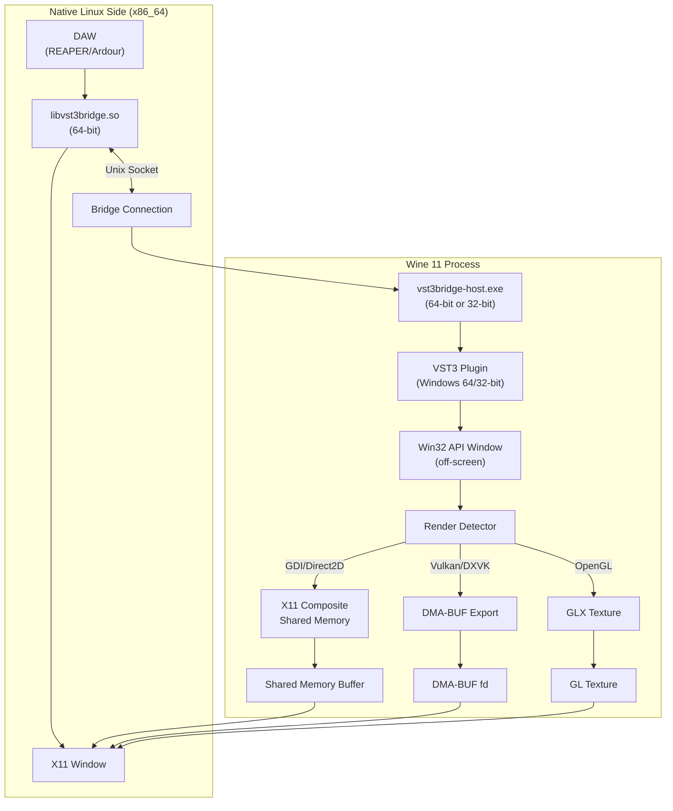

# VST3 Bridge - Implementation Plan

## Executive Summary

This plan outlines the development of a Wine VST3 bridge that works with **Wine 11+**, supports **all GPUs** (Intel/AMD/NVIDIA), uses **auto-detection** for rendering backends, and requires **no PipeWire** dependency.

## Architecture Overview



## Key Design Decisions

### 1. Off-Screen Window Strategy
Instead of embedding Wine's X11 window into the DAW (which breaks with Wine 9.22+), we create the Win32 window **off-screen** and capture its contents:

**Architecture Support:**
- **64-bit plugins** (primary target): Native Linux plugin `.so` is 64-bit, Wine host `.exe` is 64-bit
- **32-bit plugins** (via bitbridge): Native Linux plugin `.so` is 64-bit, Wine host `.exe` is 32-bit
- Most modern VST3 plugins are 64-bit, but 32-bit support is maintained for legacy plugins

```cpp
// In Wine process (works for both 32-bit and 64-bit)
HWND CreateOffscreenWindow(int width, int height) {
    // Position window at -10000, -10000 (definitely off-screen)
    return CreateWindowEx(
        WS_EX_TOOLWINDOW,
        class_name,
        "VST3Bridge",
        WS_POPUP,
        -10000, -10000,  // Off-screen coordinates
        width, height,
        nullptr, nullptr, 
        GetModuleHandle(nullptr),
        nullptr
    );
}
```

### 2. Auto-Detection of Rendering Backend

The bridge automatically detects how the plugin is rendering:

```cpp
enum class RenderBackend {
    GDI,        // Standard Windows GDI
    Direct2D,   // Direct2D (often falls back to GDI)
    OpenGL,     // OpenGL context
    Vulkan,     // Vulkan/DXVK
    Unknown
};

RenderBackend DetectRenderBackend(HWND window) {
    // Check for OpenGL context
    HDC hdc = GetDC(window);
    if (wglGetCurrentContext() != nullptr) {
        return RenderBackend::OpenGL;
    }
    
    // Check for Vulkan via DXGI
    if (IsVulkanPresent()) {
        return RenderBackend::Vulkan;
    }
    
    // Default to GDI capture
    return RenderBackend::GDI;
}
```

### 3. Multi-Path Rendering Support

| Backend | Capture Method | GPU Support | Latency |
|---------|----------------|-------------|---------|
| GDI/Direct2D | X11 Composite + Shared Memory | CPU | ~16ms |
| OpenGL | GLX Texture from context | GPU | <1ms |
| Vulkan/DXVK | DMA-BUF export | GPU | <1ms |

---

## Phase 1: Foundation (Weeks 1-4)

### Goal: Basic project structure and GDI plugin support

#### Week 1-2: Project Setup

**What is Meson?**
Meson is a modern, fast build system designed to be both extremely fast and user-friendly. Unlike older systems like Autotools or CMake, Meson uses a simple, readable Python-like syntax. Key features:
- **Fast**: 10x faster than CMake for incremental builds
- **Readable**: Clean, declarative syntax
- **Cross-compilation**: Built-in support for compiling Windows binaries from Linux
- **Dependency management**: Automatic fetching of dependencies

Yabridge uses Meson because it elegantly handles the complexity of cross-compiling both native Linux code and Windows code (via Winegcc) in the same project.

**Setup tasks:**
- [ ] Set up Meson build system (adapt from yabridge)
- [ ] Create VST3 SDK integration
- [ ] Set up Wine cross-compilation
- [ ] Create basic plugin structure

**Example meson.build structure:**
```python
project('vst3bridge', 'cpp',
    version : '1.0.0',
    default_options : ['cpp_std=c++20']
)

# Native Linux plugin library
shared_library('vst3bridge',
    native : true,  # Compiles for Linux
    sources : native_sources,
    dependencies : [xcb_dep, x11_dep]
)

# Wine host executable (cross-compiled)
executable('vst3bridge-host',
    native : false,  # Cross-compiles for Windows via Wine
    sources : wine_sources,
    dependencies : [wine_dep, vst3_sdk_dep]
)
```

**Files to create:**
```
vst3bridge/
├── meson.build
├── meson_options.txt
├── src/
│   ├── common/
│   │   ├── communication.h      # Socket-based IPC
│   │   ├── audio_shm.h          # Shared memory for audio
│   │   └── serialization.h      # Message serialization
│   ├── native/
│   │   ├── vst3_plugin.cpp      # Native VST3 plugin entry
│   │   ├── vst3_plugin.h
│   │   └── x11_display.cpp      # X11 window management
│   └── wine/
│       ├── host_main.cpp        # Wine process entry
│       ├── vst3_host.cpp        # VST3 hosting logic
│       └── window_capture.cpp   # Window capture system
```

#### Week 3-4: Basic GDI Capture
- [ ] Implement off-screen Win32 window creation
- [ ] Implement X11 Composite redirect capture
- [ ] Implement shared memory buffer for pixels
- [ ] Implement XShmPutImage display in native plugin

**Key implementation:**

```cpp
// window_capture_gdi.cpp - Wine side
class GDICapture {
public:
    bool Initialize(HWND window) {
        window_ = window;
        
        // Get X11 window handle from Win32 window
        Display* display = XOpenDisplay(nullptr);
        Window x11_window = GetX11Window(window);
        
        // Enable Composite redirect to off-screen pixmap
        XCompositeRedirectWindow(display, x11_window, CompositeRedirectAutomatic);
        
        // Create shared memory segment
        shm_segment_ = CreateShmSegment(width_, height_);
        
        return true;
    }
    
    bool CaptureFrame() {
        // Get the off-screen pixmap
        Pixmap pixmap = XCompositeNameWindowPixmap(display_, x11_window_);
        
        // Copy to shared memory
        XShmGetImage(display_, pixmap, shm_image_, 0, 0, AllPlanes);
        
        XFreePixmap(display_, pixmap);
        return true;
    }
    
private:
    HWND window_;
    Display* display_;
    Window x11_window_;
    XImage* shm_image_;
    int shm_fd_;
};
```

```cpp
// x11_display.cpp - Native side
class X11Display {
public:
    bool Initialize(Window parent_window) {
        display_ = XOpenDisplay(nullptr);
        
        // Create window embedded in DAW's parent
        window_ = XCreateSimpleWindow(
            display_, parent_window,
            0, 0, width_, height_,
            0, 0, 0
        );
        
        // Attach to shared memory
        shm_image_ = XShmCreateImage(
            display_, visual_, depth_, ZPixmap,
            nullptr, &shm_segment_, width_, height_
        );
        
        return true;
    }
    
    void UpdateDisplay() {
        // Fast zero-copy display update
        XShmPutImage(
            display_, window_, gc_,
            shm_image_, 0, 0, 0, 0,
            width_, height_, False
        );
        XFlush(display_);
    }
};
```

---

## Phase 2: GPU Support (Weeks 5-8)

### Goal: Add Vulkan/DXVK and OpenGL support via DMA-BUF

#### Week 5-6: Vulkan/DMA-BUF Support
- [ ] Implement Vulkan instance detection
- [ ] Implement DMA-BUF export from Vulkan image
- [ ] Implement DMA-BUF import on native side (EGL)

**Key implementation:**

```cpp
// vulkan_capture.cpp - Wine side
class VulkanCapture {
public:
    bool Initialize(VkDevice device, VkImage image) {
        // Create DMA-BUF from Vulkan image
        VkMemoryGetFdInfoKHR get_fd_info = {
            .sType = VK_STRUCTURE_TYPE_MEMORY_GET_FD_INFO_KHR,
            .memory = image_memory_,
            .handleType = VK_EXTERNAL_MEMORY_HANDLE_TYPE_DMA_BUF_BIT_EXT
        };
        
        PFN_vkGetMemoryFdKHR vkGetMemoryFd = 
            (PFN_vkGetMemoryFdKHR)vkGetDeviceProcAddr(device, "vkGetMemoryFdKHR");
        
        vkGetMemoryFd(device, &get_fd_info, &dma_buf_fd_);
        
        // Send FD to native process via Unix socket
        SendDmaBufFd(dma_buf_fd_, width_, height_, format_);
        
        return true;
    }
    
private:
    int dma_buf_fd_;
};
```

```cpp
// egl_display.cpp - Native side
class EGLDisplay {
public:
    bool ImportDmaBuf(int fd, int width, int height, int format) {
        // Create EGL image from DMA-BUF
        EGLint attribs[] = {
            EGL_WIDTH, width,
            EGL_HEIGHT, height,
            EGL_LINUX_DRM_FOURCC_EXT, format,
            EGL_DMA_BUF_PLANE0_FD_EXT, fd,
            EGL_DMA_BUF_PLANE0_OFFSET_EXT, 0,
            EGL_DMA_BUF_PLANE0_PITCH_EXT, width * 4,
            EGL_NONE
        };
        
        EGLImage image = eglCreateImageKHR(
            egl_display_, EGL_NO_CONTEXT,
            EGL_LINUX_DMA_BUF_EXT, nullptr, attribs
        );
        
        // Bind to GL texture
        glBindTexture(GL_TEXTURE_2D, texture_);
        glEGLImageTargetTexture2DOES(GL_TEXTURE_2D, image);
        
        return true;
    }
    
    void Render() {
        // Render texture to X11 window
        glXSwapBuffers(x11_display_, glx_window_);
    }
};
```

#### Week 7-8: OpenGL Support
- [ ] Implement OpenGL context detection
- [ ] Implement GLX texture sharing
- [ ] Test with Intel/AMD/NVIDIA drivers

---

## Phase 3: Plugin Groups & Polish (Weeks 9-12)

### Goal: Multiple plugins per Wine process, management tool

#### Week 9-10: Plugin Groups
- [ ] Implement group host process
- [ ] Add plugin instance management
- [ ] Optimize shared resources

```cpp
// group_host.cpp
class GroupHost {
public:
    void AddPlugin(const std::string& plugin_path) {
        // Load VST3 in existing process
        auto plugin = std::make_unique<VST3Plugin>(plugin_path);
        
        // Share X11 display connection
        plugin->SetDisplay(shared_display_);
        
        plugins_.push_back(std::move(plugin));
    }
    
private:
    Display* shared_display_;
    std::vector<std::unique_ptr<VST3Plugin>> plugins_;
};
```

#### Week 11-12: Management Tool & Configuration
- [ ] Create `vst3bridgectl` utility (like yabridgectl)
- [ ] Add configuration file support
- [ ] Add per-plugin backend override

```toml
# ~/.config/vst3bridge/config.toml
[global]
default_backend = "auto"  # auto, gdi, opengl, vulkan

[plugins]
"Serum.vst3" = { backend = "vulkan" }
"FabFilter.vst3" = { backend = "gdi" }
```

---

## Architecture & Platform Support

### CPU Architecture Support

The bridge supports both 64-bit and 32-bit Windows VST3 plugins on 64-bit Linux:

```
┌─────────────────────────────────────────────────────────────────┐
│                        Linux x86_64                              │
│                                                                  │
│  ┌─────────────────┐        ┌─────────────────────────────────┐ │
│  │ Native Plugin   │        │         Wine Process            │ │
│  │ libvst3bridge.so│        │ ┌─────────────────────────────┐ │ │
│  │     (64-bit)    │◄──────►│ │ 64-bit vst3bridge-host.exe  │ │ │
│  └─────────────────┘        │ │   for 64-bit VST3 plugins   │ │ │
│                             │ └─────────────────────────────┘ │ │
│                             │ ┌─────────────────────────────┐ │ │
│                             │ │ 32-bit vst3bridge-host.exe  │ │ │
│                             │ │   for 32-bit VST3 plugins   │ │ │
│                             │ │    (via bitbridge)          │ │ │
│                             │ └─────────────────────────────┘ │ │
│                             └─────────────────────────────────┘ │
└─────────────────────────────────────────────────────────────────┘
```

**Implementation Details:**
- Native Linux side is always 64-bit (matches DAW architecture)
- Wine host processes:
  - `vst3bridge-host.exe` (64-bit) for 64-bit VST3 plugins
  - `vst3bridge-host-32.exe` (32-bit) for 32-bit VST3 plugins
- Auto-detection of plugin architecture via PE32/PE32+ header parsing
- Same codebase compiled twice via Meson cross-compilation (see yabridge's approach in [`meson.build`](yabridge-5.1.1/meson.build:402))

### Plugin Format Support
- **Primary**: VST3 (modern standard, focus of this project)
- **Future**: CLAP (can reuse same architecture)
- **Out of scope**: VST2 (deprecated by Steinberg)

## Technical Specifications

### Communication Protocol

**Socket types:**
1. **Control socket**: Plugin lifecycle, parameters
2. **Audio socket**: Real-time audio streaming
3. **GUI socket**: Frame updates, input events

**Message format:**
```cpp
struct Message {
    uint32_t type;      // Message type
    uint32_t size;      // Payload size
    uint64_t timestamp; // For latency measurement
    uint8_t payload[];  // Variable-length payload
};

enum class MsgType : uint32_t {
    // Control
    PluginInit = 1,
    PluginTerminate,
    ParameterChange,
    
    // Audio
    AudioBuffer = 100,
    
    // GUI
    FrameUpdate = 200,
    MouseEvent,
    KeyboardEvent,
    DmaBufImport  // For GPU path
};
```

### GPU Backend Selection Logic

```cpp
RenderBackend SelectBackend(HWND window, const Config& config) {
    // Check for explicit override
    if (config.backend_override != RenderBackend::Auto) {
        return config.backend_override;
    }
    
    // Auto-detect
    if (IsVulkanWindow(window)) {
        // Check if DMA-BUF is available
        if (HasDmaBufSupport()) {
            return RenderBackend::Vulkan;
        }
        // Fall back to GDI capture
        return RenderBackend::GDI;
    }
    
    if (IsOpenGLWindow(window)) {
        if (HasGlxTextureSupport()) {
            return RenderBackend::OpenGL;
        }
        return RenderBackend::GDI;
    }
    
    return RenderBackend::GDI;
}
```

---

## Testing Strategy

### Phase 1 Testing (GDI)
- [ ] Test with REAPER on X11
- [ ] Test with Ardour on X11
- [ ] Test plugins: FabFilter, Valhalla, basic VST3s

### Phase 2 Testing (GPU)
- [ ] Intel iGPU + DXVK
- [ ] AMD GPU + DXVK
- [ ] NVIDIA GPU + DXVK
- [ ] Test plugins: Serum, Vital, Phase Plant

### Phase 3 Testing (Groups)
- [ ] Multiple FabFilter plugins in one group
- [ ] Mix of GDI and GPU plugins
- [ ] Stress test: 10+ plugins

---

## Dependencies

### Build Dependencies
```bash
# Ubuntu/Debian
sudo apt install \
    meson ninja-build \
    libxcb1-dev libxcb-composite0-dev \
    libx11-xcb-dev \
    libegl1-mesa-dev libgles2-mesa-dev \
    libvulkan-dev \
    wine-staging-dev

# For VST3 SDK
git clone --recursive https://github.com/steinbergmedia/vst3sdk.git
```

### Runtime Dependencies
- Wine Staging 11+
- X11 with Composite extension
- For GPU path: Mesa drivers (Intel/AMD) or proprietary NVIDIA

---

## Success Metrics

1. **Functionality**: 95%+ of VST3 plugins work on Wine 11+
2. **Performance**: <5ms GUI latency for GPU path, <20ms for GDI path
3. **Compatibility**: Works on Intel/AMD/NVIDIA GPUs
4. **Stability**: No crashes during 8-hour DAW sessions

---

## Risks & Mitigation

| Risk | Impact | Mitigation |
|------|--------|------------|
| NVIDIA driver issues | High | Provide GDI fallback path |
| Plugin incompatibility | Medium | Per-plugin configuration |
| Performance issues | Medium | Profile and optimize hot paths |
| Wayland transition | Low | XWayland compatibility mode |
