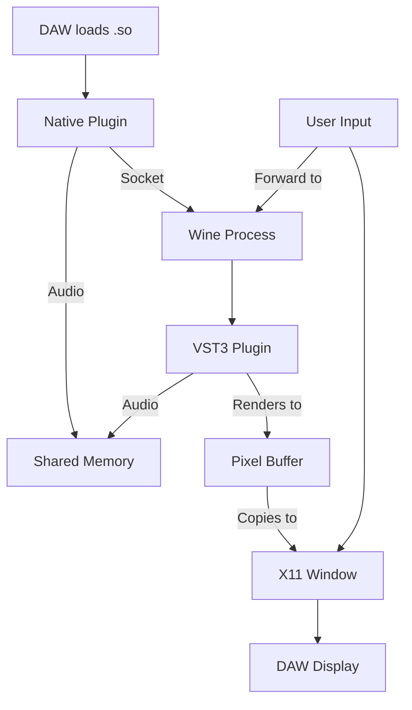

# VST3 Bridge - Architectural Analysis and Solutions

## Problem Summary

Yabridge works with WineHQ-Staging ≤ 9.21 but fails with newer versions (10/11) when the VST3 is used inside a DAW. The GUI freezes but the plugin loads. Standalone mode works fine.

---

## Root Cause Analysis

### The Core Issue: Wine X11 Window Embedding

Yabridge uses manual X11 window embedding that is extremely sensitive to Wine's internal X11 driver changes:

```
[host_window →] parent_window → wrapper_window → wine_window
```

Key problems:
1. **Window Reparenting**: Yabridge reparents Wine's X11 window into DAW's window hierarchy
2. **ConfigureNotify Events**: Manual event injection to fake window coordinates
3. **Event Routing**: Complex X11 event handling between multiple window layers

### Wine Version Compatibility Issues Found

| Wine Bug | Version | Issue |
|----------|---------|-------|
| #53912 | 7.21, 7.22, 8.0-rc1 | Critical X11 event handling freeze |
| Changes in X11 driver | 9.22+ | Modified window embedding behavior |
| Graphics driver changes | 10+ | Altered window creation/mapping |

The issue is specifically that Wine's X11 driver has changed how it handles:
- Window creation and mapping
- Reparenting operations  
- ConfigureNotify event generation
- Event dispatching to child windows

---

## X11-Focused Solutions

### Solution 1: X11 Compatibility Layer (Recommended)

Create Wine-agnostic abstractions over X11 window operations that can adapt to different Wine versions.

**Key Components**:

```
┌─────────────────────────────────────────────┐
│              Your Bridge Solution             │
├─────────────────────────────────────────────┤
│  ┌─────────────────────────────────────┐   │
│  │     Wine Version Detection           │   │
│  │   (Runtime X11 behavior probing)     │   │
│  └─────────────────────────────────────┘   │
│                    │                          │
│                    ▼                          │
│  ┌─────────────────────────────────────┐   │
│  │   X11 Compatibility Layer           │   │
│  │   (Abstraction over Wine changes)   │   │
│  └─────────────────────────────────────┘   │
│                    │                          │
│          ┌────────┴────────┐                 │
│          ▼                 ▼                 │
│   ┌───────────┐    ┌───────────┐            │
│   │ Wine 9.x  │    │ Wine 10+  │            │
│   │   Path    │    │   Path    │            │
│   └───────────┘    └───────────┘            │
└─────────────────────────────────────────────┘
```

**Implementation Details**:
1. **Behavior Probing**: On startup, test Wine's X11 behavior with a hidden window
2. **Version Detection**: Detect Wine version at runtime
3. **Adaptive Paths**: Switch between different X11 handling strategies
4. **Event Simulation**: If Wine stops sending certain events, simulate them

**Advantages**:
- Works with current Wine versions
- Maintains X11 compatibility
- Can be updated as Wine evolves

**Challenges**:
- Need to test against multiple Wine versions
- Some behaviors may be hard to detect/adapt to

---

### Solution 2: Wine-Built-in XEmbed Path

Leverage Wine's native XEmbed support instead of manual reparenting.

**Current yabridge issue**: XEmbed has rendering problems with some plugins

**Improvements**:
- Add compatibility patches for Wine's XEmbed (similar to airwave patch)
- Use Wine's built-in XEmbed as primary path
- Fall back to manual embedding only when needed

**Implementation**:
```cpp
// Detect if Wine's XEmbed works for this plugin
if (test_xembed_compatibility()) {
    use_wine_xembed();
} else {
    use_manual_embedding();
}
```

---

### Solution 3: Multi-Process GUI Isolation

Run the GUI in a completely separate Wine process and use IPC for rendering.

```
┌──────────────┐     ┌──────────────┐     ┌──────────────┐
│    DAW       │     │  Bridge      │     │   Wine       │
│              │◄───►│  Host        │◄───►│  Process     │
│  (X11 Win)   │     │  (X11 IPC)   │     │  (Plugin)    │
└──────────────┘     └──────────────┘     └──────────────┘
```

**Approaches**:

#### 3a. X11 Picture Rendering
- Render plugin GUI to X11 Picture/XPixmap
- Send pixmap to DAW via shared memory
- DAW displays in X11 window

#### 3b. X11 Remote Framebuffer
- Use X11 damage extension for dirty rectangles
- Transfer only changed regions
- Lower bandwidth than full framebuffer

**Advantages**:
- Complete Wine isolation
- No X11 embedding issues
- Works with any Wine version

**Challenges**:
- Latency in GUI updates
- Complex implementation
- Higher resource usage

---

### Solution 4: Direct X11 Pixel Buffer (Recommended for Wine 11+)

**Concept**: Completely bypass Wine's X11 window embedding system and render the plugin GUI directly to a buffer that the DAW can display.

This is the most robust solution because it doesn't rely on Wine's window management at all - it only uses Wine for running the plugin code and rendering to a pixel buffer.

```
┌─────────────────────────────────────────────────────────────────────┐
│                           Linux DAW                                  │
│   ┌─────────────────────────────────────────────────────────────┐   │
│   │  Your Bridge Plugin (.so)                                  │   │
│   │  ┌───────────────────┐    ┌──────────────────────────┐   │   │
│   │  │  X11 Window       │    │  Shared Memory Buffer    │   │   │
│   │  │  (for embedding)  │◄───│  (pixel data)            │   │   │
│   │  └───────────────────┘    └──────────────────────────┘   │   │
│   └─────────────────────────────────────────────────────────────┘   │
│                         │                                             │
│                         │ Unix Socket                                 │
│                         ▼                                             │
│   ┌─────────────────────────────────────────────────────────────┐   │
│   │  Wine Process (vst3bridge-host.exe)                        │   │
│   │  ┌─────────────────────────────────────────────────────┐  │   │
│   │  │  VST3 Plugin                                          │  │   │
│   │  │  - Renders to shared memory buffer                   │  │   │
│   │  │  - Sends parameters/audio via socket                 │  │   │
│   │  └─────────────────────────────────────────────────────┘  │   │
│   └─────────────────────────────────────────────────────────────┘   │
└─────────────────────────────────────────────────────────────────────┘
```

#### Implementation for Wine 11

**Step 1: Create Shared Memory Buffer**
```cpp
// Create a shared memory region for pixel data
struct GUISharedBuffer {
    uint32_t width;
    uint32_t height;
    uint32_t stride;  // bytes per row
    uint32_t format;  // e.g., BGRA
    uint8_t pixels[]; // actual pixel data
};

// Use POSIX shared memory or DMA-BUF
int shm_fd = shm_open("/vst3bridge_gui_XXXXX", O_CREAT | O_RDWR, 0666);
ftruncate(shm_fd, sizeof(GUISharedBuffer) + width * height * 4);
```

**Step 2: Provide Buffer to Wine/Plugin**
- Pass the shared memory file descriptor to Wine via environment variable or socket
- Wine plugin renders directly to this buffer instead of to a window

**Step 3: Wine Configuration**
```bash
# Tell Wine to use offscreen rendering
WINEDLLOVERRIDES="gdi32=n" wine ...
# Or use Virtual Framebuffer
```

**Step 4: Display in DAW**
- Native Linux plugin creates X11 window (provided by DAW)
- Copy pixels from shared buffer to X11 window using:
  - XShmPutImage for shared memory (fast)
  - XPutImage for regular memory (compatible)

#### Why This Works with Wine 11+

1. **No Window Embedding**: Completely avoids Wine's X11 window reparenting
2. **Direct Rendering**: Plugin renders to memory buffer, not to X11 window
3. **Wine-Agnostic**: Doesn't depend on Wine's X11 driver behavior
4. **Future-Proof**: As long as Wine can render to a buffer, this works

#### Technical Details

**Buffer Format**:
- BGRA or RGBA pixel format (matching common VST3 plugin output)
- 32-bit per pixel (8 bits each channel)
- Row stride aligned to 4 bytes for performance

**Update Mechanism**:
```cpp
// Use X damage extension for efficient updates
XDamageCreate(display, window, XDamageReportRawRectangles);

// When damage event received:
void handle_damage(XDamageNotifyEvent* event) {
    // Copy only damaged region from shared buffer to X11
    XShmPutImage(display, window, gc, shm_image,
                 event->area.x, event->area.y,  // source
                 event->area.x, event->area.y,  // dest
                 event->area.width, event->area.height,
                 False);  // don't wait
}
```

**Performance Considerations**:
- Shared memory avoids copying between processes
- XShmPutImage is very fast (zero-copy on modern systems)
- Damage extension minimizes updates (only changed regions)
- Target 60fps GUI refresh rate

#### Advantages for Wine 11

| Benefit | Explanation |
|---------|-------------|
| Stable | Doesn't depend on Wine's changing X11 internals |
| Fast | Zero-copy shared memory + XShmPutImage |
| Compatible | Works with any Wine version that supports GDI/drawing |
| Maintainable | Only need to update buffer format, not window handling |

#### Challenges

1. **Plugin Support**: Some plugins may not render to offscreen buffer
2. **Input Handling**: Mouse/keyboard events need to be sent back to Wine
3. **DXVK Integration**: If plugin uses DXVK for rendering, need different approach

#### Fallback for DXVK Plugins

For plugins that require GPU rendering:
```cpp
if (plugin_uses_dxvk()) {
    // Use PipeWire screen capture instead
    use_pipewire_capture(pipewire_node_id);
} else {
    // Use shared memory buffer
    use_shm_buffer();
}
```

---

### Solution 3: Multi-Process GUI Isolation

---

## Recommended Approach: Direct X11 Pixel Buffer for Wine 11

Given that Wine 11 is the current version and most users will be on it, **Solution 4 (Direct X11 Pixel Buffer)** is recommended as the primary approach. This bypasses all Wine X11 window embedding issues entirely.

### Architecture for Wine 11



### Implementation Phases

#### Phase 1: Foundation (Weeks 1-4)
- Set up project structure with Meson build system
- Implement shared memory audio buffer (can adapt from yabridge)
- Create Unix socket communication layer
- Basic VST3 plugin loader

#### Phase 2: Direct Pixel Buffer (Weeks 5-8)
- Create shared memory pixel buffer for GUI
- Implement Wine-side buffer rendering
- Add X11 window creation in native plugin
- Implement XShmPutImage for fast updates

#### Phase 3: Input Handling (Weeks 9-10)
- Capture mouse events from X11 window
- Forward events to Wine via socket
- Handle keyboard input

#### Phase 4: Polish (Weeks 11-12)
- Add plugin group support
- Implement configuration system
- Create management utility
- Test with popular VST3 plugins

---

## Key Technical Decisions

### Use XCB Instead of Xlib
- Better async support
- Easier event handling
- More reliable connection management

### Shared Memory for GUI
- Create pixel buffer in shared memory
- Zero-copy rendering from Wine to X11
- Use XShmPutImage for fast updates

### Keep Shared Memory for Audio
- Already proven to work in yabridge
- Low latency
- Works across Wine versions

### Socket Communication for Parameters
- Keep existing approach (works)
- Only change GUI handling

### Configuration System
- Similar to yabridge.toml
- Per-plugin settings
- Wine version override option

---

## What Makes This Different from Yabridge

| Aspect | Yabridge | This Solution |
|--------|----------|---------------|
| GUI Rendering | Wine X11 window embedding | Direct pixel buffer |
| Wine Dependency | Tightly coupled to Wine X11 driver | Wine-agnostic rendering |
| Wine 11 Support | Broken | Designed for Wine 11+ |
| Performance | Depends on Wine X11 | Zero-copy via shared memory |
| Future Proof | Breaks with Wine updates | Stable across versions |

---

## Implementation Roadmap

### Phase 1: Foundation (Weeks 1-4)
- Set up project structure with Meson build system
- Implement shared memory audio buffer (can adapt from yabridge)
- Create Unix socket communication layer
- Basic VST3 plugin loader

### Phase 2: Direct Pixel Buffer (Weeks 5-8)
- Create shared memory pixel buffer for GUI
- Implement Wine-side buffer rendering path
- Add X11 window creation in native plugin
- Implement XShmPutImage for fast updates

### Phase 3: Input Handling (Weeks 9-10)
- Capture mouse events from X11 window
- Forward events to Wine via socket
- Handle keyboard input

### Phase 4: Polish (Weeks 11-12)
- Add plugin group support
- Implement configuration system
- Create management utility (like yabridgectl)
- Extensive testing with popular VST3 plugins
